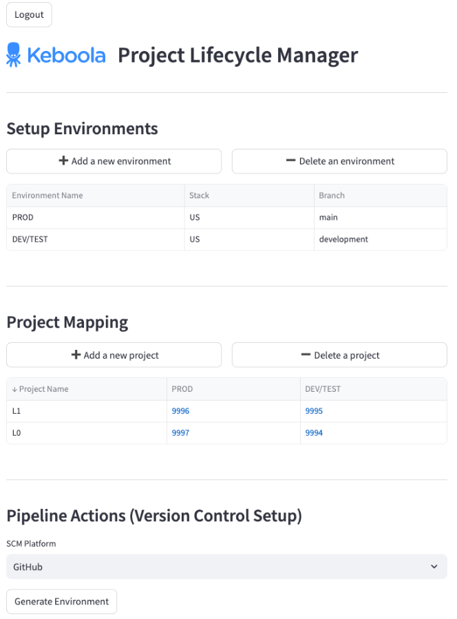

# Supportive Streamlit App for Keboola CLI DEV/OPS Environment Management

Example Streamlit application enabling setup of a Multi-Stage Keboola Connection environments.

## Functionality

- Define Environments and their mapping to git branches
- Define Keboola project mappings across environments
- Generate GitHub actions for CI automation and environment deployment

## Deployment

- Ready to be deployed as [Keboola Data App](https://help.keboola.com/components/data-apps/)

## Resources

- [Dev/Ops Management Use case documentation](https://developers.keboola.com/cli/devops-use-cases/#multi-stage-and-multi-project-environment-management)
- [Blog post showcasing the use case](https://www.keboola.com/blog/keboola-dev-prod-lifecycle-via-git)